<!--
DRAFT STATUS (delete this block before submission)
- Every number in Sections 3-5 comes from results/*.csv|json and docs/experiment_log.md.
- TODO(robustness): Section 4.5, the robustness sentences in Sections 5 and 7, and the Abstract are waiting on the
  full robustness run (results/robustness.csv). Nothing in those places is final.
- TODO(realtime): the real-time app was verified on simulated frames with the trained models (Section 3.9) but NOT run
  live on a webcam with a person in front of it. If you run it, add the observed FPS and behaviour there.
- TODO(references): all references were written from memory. Verify each one (authors, year, venue, pages/DOI)
  before submitting, and add the literature that your department expects in Section 2. Formatting (APA vs IEEE,
  page count, template) is not applied yet.
- This is a first draft of the writing, not a finished paper. Read it, correct it, and put it in your own words.
-->

# Recognising Driver Emotions from Facial Images under Urban Traffic Conditions: A Comparison of a Custom VGG-Style CNN and Fine-Tuned VGG16

**Author:** *[your name]* &nbsp;|&nbsp; **Supervisor:** *[name]* &nbsp;|&nbsp; **Institution / Department:** *[…]* &nbsp;|&nbsp; **Date:** *[…]*

## Abstract

*TODO: write last, after the robustness results are final (about 200 words: problem, the two models, the headline numbers, the robustness finding, the main limitation).*

**Keywords:** facial expression recognition, driver monitoring, convolutional neural networks, transfer learning, robustness, Grad-CAM, FER2013

---

## 1. Introduction

Road traffic injuries remain a leading cause of death worldwide [1], and a substantial share of crashes involve driver error rather than mechanical failure. A driver's emotional state is one factor that can degrade driving: anger and other high-arousal states are associated with aggressive behaviour, and low-arousal states such as sadness with reduced attention [2, 3]. If a vehicle could notice, from the driver's face, that the driver is becoming angry or afraid, it could respond with a calm prompt, a change in assistance level, or a record for the driver's own review. This is the motivation behind *driver monitoring systems* that use an in-cabin camera.

Recognising emotion from a face is a hard problem even in benign conditions. Expressions are subtle and ambiguous, human annotators disagree with one another, and the standard benchmark used here (FER2013) is known to be noisy [4, 5]. Driving makes it harder still. Illumination changes quickly, from tunnels to low sun; motion and vibration blur the image; hands, sunglasses and steering-wheel spokes occlude the face; and the driver's head is rarely frontal. A model that scores well on a clean benchmark may therefore fail on the road, and an accuracy figure alone does not say how.

This project studies that gap with a deliberately simple design: two convolutional models, one benchmark, and a controlled set of "urban traffic" corruptions.

**Research questions.**

- **RQ1.** How does a compact custom CNN built from VGG-style blocks, trained from scratch, compare with an ImageNet-pretrained VGG16 fine-tuned by two-stage transfer learning, in overall accuracy, per-class behaviour and computational cost?
- **RQ2.** How does each model degrade under conditions typical of driving: low light, glare, motion blur, partial occlusion and head rotation?
- **RQ3.** Where in the face does each model look when it is right, and when it is wrong?
- **RQ4.** Is inference cheap enough for a commodity CPU to run a live pipeline?

**Contributions.** (i) A like-for-like comparison of the two models under one preprocessing pipeline, one data split and one evaluation protocol, with all results logged. (ii) A reproducible robustness protocol for simulated driving conditions applied to the whole test set. (iii) A Grad-CAM analysis of correct and incorrect predictions. (iv) A real-time pipeline and its measured inference cost. (v) An account of the pitfalls met along the way (Section 5.4), several of which silently produced plausible-looking but wrong numbers, because they are the kind of error that also affects published comparisons.

**Scope.** All accuracy claims are on FER2013 and on *simulated* degradations of it. No in-cabin footage was used, so the results do not establish performance on real drivers (Section 5.5).

---

## 2. Literature review

*This section is a scaffold. It contains only claims I am confident are well established; it needs your department's expected depth, and every citation must be verified.*

### 2.1 Emotion and driving

Discrete-emotion models, in which a small set of "basic" emotions is recognisable across cultures from facial expression, go back to Ekman and Friesen [6]. FER2013 and most subsequent benchmarks use the seven-class version (anger, disgust, fear, happiness, sadness, surprise, neutral). Studies of emotion in driving report that specific emotional states, notably anger, are associated with riskier driving behaviour, and that sadness can impair performance as well [2, 3]. That is the rationale for treating anger and fear as the *alert* emotions in our real-time application (Section 3.9), while acknowledging that a facial expression is not the same thing as an inner state (Section 6).

### 2.2 Facial expression recognition and FER2013

Facial expression recognition (FER) with deep networks is surveyed in [7]. The FER2013 dataset [4] contains 48 × 48 grayscale faces collected from the web and labelled with seven emotions; it became a standard benchmark because it is large, free and difficult. Its labels are noisy: the original report notes human accuracy of roughly 65% [4], and relabelling efforts such as FER+ [5] were produced precisely because of this. Later datasets such as AffectNet [8] are larger and collected in the wild. Reported FER2013 accuracies for single, heavily tuned VGG-style networks are in the low 70s percent [9]; results in that range typically involve extensive hyper-parameter search, specific optimisers and schedules, and test-time augmentation, none of which are attempted here. A ceiling well below 100% should therefore be expected, and our results should be read against that ceiling and not against 100%.

### 2.3 Convolutional architectures and transfer learning

Deep convolutional networks [10, 11] are the dominant approach to image classification. VGG [12] showed that stacking small 3 × 3 convolutions between pooling layers gives a simple, effective and easily described design; VGG16 trained on ImageNet [13] is a common starting point for transfer learning. Batch normalisation [14] and dropout [15] are standard regularisers, and Adam [16] a standard optimiser. Transfer learning is usually most valuable when the target data are scarce and resemble the source domain. FER2013 is small by modern standards but differs from ImageNet in resolution, colour and content, so it is not obvious in advance that transfer will beat a compact network trained from scratch. RQ1 tests exactly this.

### 2.4 Driver monitoring

In-cabin driver monitoring typically combines a camera (often near-infrared, so that it works at night) with models for attention, drowsiness and, more recently, affect. Publicly available data for *driver* expressions are scarce. KMU-FED [17] is a database of facial expressions captured in a vehicle; we did not obtain it, which is a limitation of this study (Section 5.5).

### 2.5 Explaining what a network looks at

Grad-CAM [18] uses the gradient of a class score with respect to the activations of a late convolutional layer to produce a coarse heat map of the regions that most influenced that score. It is widely used to check whether a classifier attends to plausible evidence or to an artefact such as the background. It is a diagnostic, not a proof of causal reliance.

### 2.6 Gap addressed here

Comparisons of FER models usually report clean-test accuracy and stop. We add a controlled robustness sweep motivated by driving, compare a compact from-scratch model against a fine-tuned pretrained model on cost as well as accuracy, and inspect both correct and incorrect predictions.

---

## 3. Methodology

### 3.1 Data

We used the FER2013 images as distributed in the widely used Kaggle folder version, arranged as one directory per class. The **train** partition has 28,709 images and the **test** partition 7,178 (the latter equals the combined size of the original PublicTest and PrivateTest partitions). Images are 48 × 48, 8-bit grayscale. Class counts are strongly imbalanced (Table 1; Figure 1): *disgust* is about 16.5 times rarer than *happy* in training.

**Table 1.** FER2013 class counts.

| Class | Train | Test |
|---|---|---|
| angry | 3,995 | 958 |
| disgust | 436 | 111 |
| fear | 4,097 | 1,024 |
| happy | 7,215 | 1,774 |
| neutral | 4,965 | 1,233 |
| sad | 4,830 | 1,247 |
| surprise | 3,171 | 831 |
| **Total** | **28,709** | **7,178** |

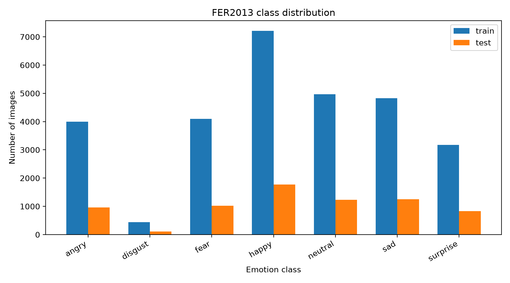

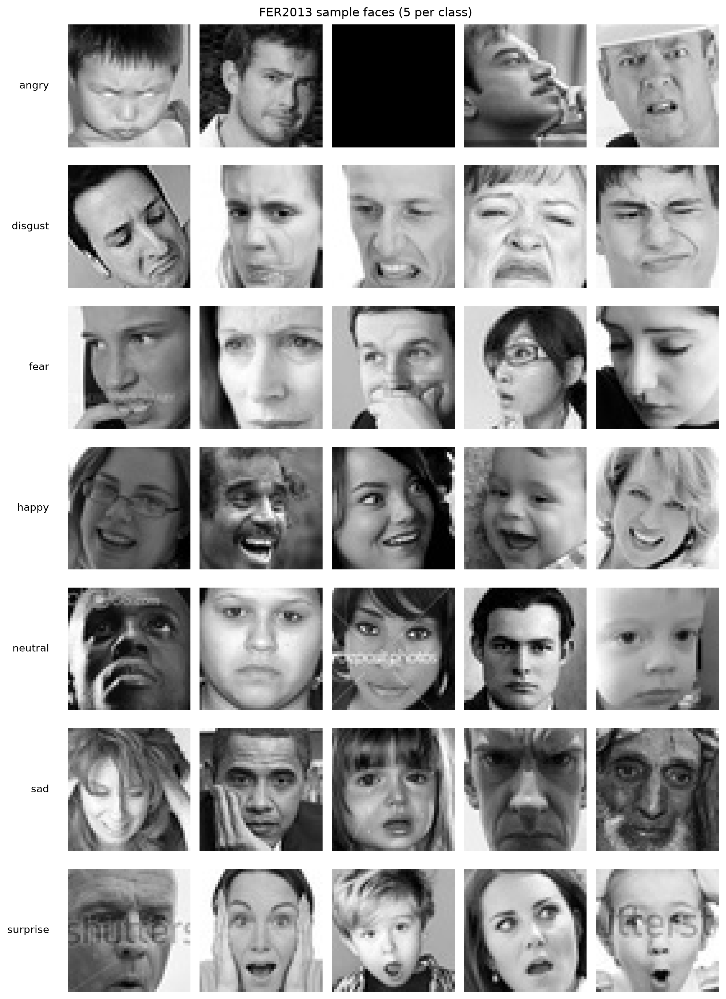

A validation set was carved from the training partition (15%, seed 42), giving 24,403 training and 4,306 validation images. The split is by file and is not stratified by class. **The test partition was used only for the final evaluation, and for choosing nothing.** Model selection used the validation set alone.

### 3.2 Preprocessing and augmentation

Both models share one preprocessing module (`src/preprocess.py`) that is used identically in training, evaluation, robustness testing and the live application, so that a live frame is transformed exactly like a training image.

- **Custom CNN:** grayscale, 48 × 48, pixel values scaled to [0, 1].
- **VGG16:** grayscale converted to three channels, resized to 224 × 224 (bilinear), then Keras' VGG16 `preprocess_input` (per-channel mean subtraction).

Training images are augmented with a random horizontal flip, rotation (factor 0.05, i.e. up to ±18°), zoom (10%), brightness (±20%) and contrast (±20%). Augmentation is applied to the raw [0, 255] pixels *before* the model-specific rescaling; the reason is a bug described in Section 5.4.

### 3.3 Model A: custom VGG-style CNN

The custom CNN (4,826,055 parameters) has four VGG-style blocks. Each block is two 3 × 3 convolutions (padding "same", L2 weight decay 10⁻⁴), each followed by batch normalisation and ReLU, then 2 × 2 max-pooling and dropout 0.25. The blocks use 64, 128, 256 and 512 filters. The head is global average pooling, a 256-unit dense layer with batch normalisation, ReLU and dropout 0.4, and a 7-way softmax. Layers are named (`block1_conv1`, …, `block4_conv2`) so that the network reads clearly in a viewer and so that Grad-CAM can target `block4_conv2`. The architecture is drawn in Figure 3.

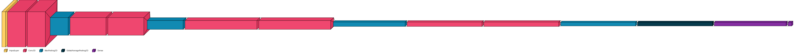

### 3.4 Model B: VGG16 with two-stage transfer learning

Model B (14,980,935 parameters) is Keras' VGG16 with ImageNet weights and no top, followed by global average pooling, a 512-unit ReLU dense layer, dropout 0.5 and a 7-way softmax (Figure 4). Training has two stages. **Stage 1** (15 epochs, learning rate 10⁻³) trains only the new head with the convolutional base frozen (266,247 trainable parameters). **Stage 2** (25 epochs, learning rate 10⁻⁵) unfreezes the last convolutional block (`block5_conv1` onward) and fine-tunes it together with the head. Layers up to `block4_pool` remain frozen throughout.

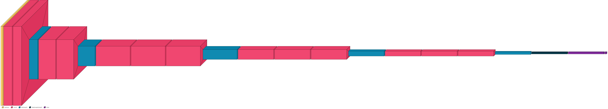

### 3.5 Training protocol

Both models use Adam [16] and sparse categorical cross-entropy, with class weights (Section 3.6). Callbacks are shared: the checkpoint with the best **validation** accuracy is kept; early stopping (patience 10, restore best weights); `ReduceLROnPlateau` on validation accuracy (factor 0.5, patience 4). The custom CNN used batch size 64 and a maximum of 60 epochs from a learning rate of 10⁻³; VGG16 used batch size 32 and the two stages above. Random seeds were fixed (seed 42) for Python, NumPy and TensorFlow, but the GPU kernels are not bit-wise deterministic, and **each model was trained once**, so run-to-run variation is not measured. Training was done on a Kaggle NVIDIA T4 GPU (custom CNN: 21.5 min; VGG16: 123.4 min). Software: Python 3.11.15, TensorFlow 2.20 / Keras 3.15 for the local evaluation.

### 3.6 Handling class imbalance

sklearn's "balanced" class weights give *disgust* a weight of about 9.4. In our runs this destabilised training: in a controlled comparison (same seed and data, 15% subset), training with no class weights progressed normally, whereas balanced weights left training accuracy at chance level, and lowering the learning rate to 3 × 10⁻⁴ did not resolve it over the four epochs tested. We therefore use **square-root-damped weights capped at 3.0** (disgust 9.4 → 3.0), which keeps an imbalance correction without the instability, and report macro-F1 alongside accuracy so that majority-class behaviour is visible.

### 3.7 Evaluation metrics and protocol

On the full test partition we report accuracy, macro-F1 (the unweighted mean of per-class F1, which weights the rare classes equally), weighted-F1, per-class precision, recall and F1, and row-normalised confusion matrices. We also record parameter count, saved file size and single-image inference latency: the mean and 95th percentile of 200 timed calls after 20 warm-up calls, using direct `model(x)` calls on one image, from which frames per second (FPS) is derived. Latency was measured on the development laptop (Intel Core i5-8265U, 8 threads, no GPU), so it says something about a modest CPU and nothing about an in-vehicle processor.

### 3.8 Robustness protocol

To probe RQ2, six conditions are applied to *every* test image (7,178), deterministically (seeded generator), at native 48 × 48 resolution before the model-specific resize:

| Condition | Simulation |
|---|---|
| clean | none (baseline) |
| low_light | brightness × 0.4, plus Gaussian noise (σ = 10), for night driving or tunnels |
| glare | brightness × 1.6, plus a random bright, blurred elliptical blob, for sun on the windscreen |
| motion_blur | horizontal 7-pixel box blur, for vehicle motion and vibration |
| occlusion | a random black rectangle covering about 20% of the image, for a hand or sunglasses |
| head_pose | in-plane rotation drawn uniformly from ±20°, for a driver glancing away |

Both models are re-evaluated on each corrupted copy of the test set and accuracy and macro-F1 are recorded. These are *simulations*: they are cheap and reproducible but they are not real recordings, and "head_pose" is only an in-plane rotation, not a change of viewpoint.

### 3.9 Explainability and the real-time pipeline

**Grad-CAM.** Heat maps are computed from `block4_conv2` (custom CNN, a 6 × 6 map at 48-pixel input) and `block5_conv3` (VGG16, a 14 × 14 map), for the class the model predicted, and overlaid on the face. Because of the compute involved, the figures use a class-balanced 25% subset of the test set (about 1,800 images). We show one example per emotion that both models classify correctly, and six misclassified examples per model, one per true class for the six classes with most errors.

**Real-time pipeline.** The application captures frames with OpenCV, detects faces with MediaPipe's BlazeFace detector [19] (falling back to an OpenCV Haar cascade if MediaPipe is unavailable), crops the largest face with 15% padding, applies the shared preprocessing, predicts, and smooths the class probabilities with a 10-frame moving average. If *angry* or *fear* remains the top class for more than 3 seconds it shows an on-screen prompt. Per-frame output (timestamp, emotion, confidence, FPS) is logged to a CSV; **no image is stored**. *Verification status:* the full detect-crop-preprocess-predict path was run with the trained checkpoints on *simulated* frames (a test face enlarged six times and placed on a grey 640 × 480 canvas). A face was found in 118 of 120 frames for the custom CNN and 38 of 40 for VGG16. End-to-end accuracy on those frames was 0.669 (CNN, n = 118) and 0.789 (VGG16, n = 38; a small sample), against 0.708 and 0.725 for the same models applied directly to the original 48-pixel images, differences that are within sampling noise at these sample sizes. However, the label produced by the real-time path agreed with the direct label on only 78% (CNN) and 76% (VGG16) of frames: the detector's box plus 15% padding frames the face differently from the tight FER2013 crops the models were trained on, and individual predictions are sensitive to that framing. The complete loop has **not** been evaluated live with drivers or a real camera, so no live accuracy or frame-rate claim is made for it.

---

## 4. Results

### 4.1 Training behaviour

The custom CNN was trained for the full 60 epochs; its best validation accuracy of **0.6665** occurred at epoch 59. The learning rate was halved six times by `ReduceLROnPlateau` (at epochs 11, 24, 30, 38, 48 and 55), from 10⁻³ to 1.6 × 10⁻⁵. Validation loss reached its minimum (1.092) at epoch 32 and stayed near 1.12 afterwards, and validation accuracy gained only about one point over the last twenty epochs, while training accuracy kept rising to 77%: a moderate generalisation gap, not runaway overfitting (Figure 5).

VGG16's frozen-base stage plateaued at about 48–50% validation accuracy (50.1% at the end of stage 1). Unfreezing the last block produced an immediate jump (55.4% in the first fine-tuning epoch) and a best validation accuracy of **0.6600** at epoch 38 of 40. From about epoch 20, its validation loss flattens near 1.0 while training loss keeps falling (73.6% training vs. 65.7% validation at the end), so it overfits somewhat more than the custom CNN (Figure 5).

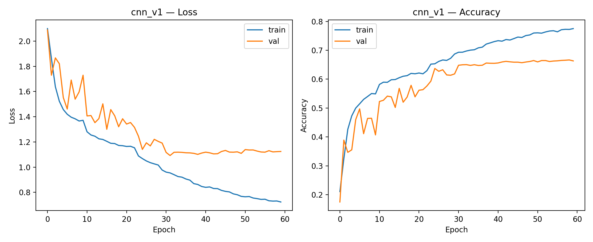
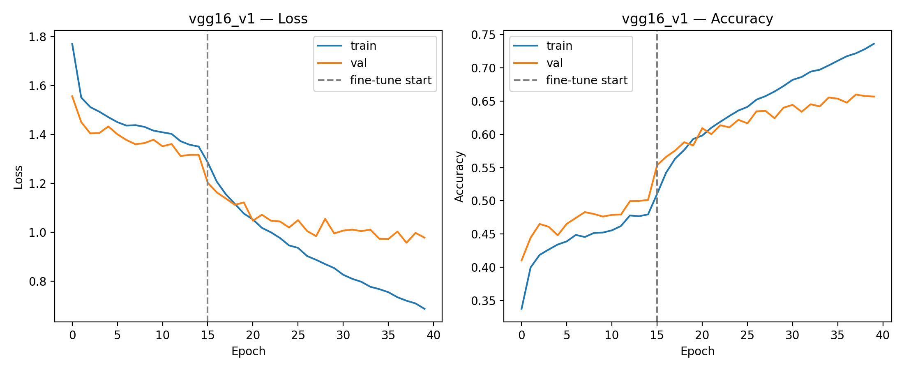

### 4.2 Test-set performance

**Table 2.** Test-set results (7,178 images; the test set was not used for any selection).

| | Custom CNN | VGG16 (fine-tuned) |
|---|---|---|
| Accuracy | **0.6753** | 0.6581 |
| Macro-F1 | **0.6595** | 0.6397 |
| Weighted-F1 | **0.6743** | 0.6506 |
| Best validation accuracy | 0.6665 | 0.6600 |
| Parameters | 4.83 M | 14.98 M |
| File size | 55.4 MiB | 113.3 MiB |
| Latency, mean / p95 (CPU, 1 image) | 39.9 / 48.4 ms | 216.2 / 224.1 ms |
| Throughput | **25.1 FPS** | 4.6 FPS |

Test accuracy is close to validation accuracy for both models (0.6753 vs 0.6665; 0.6581 vs 0.6600), which indicates that selecting the checkpoint on validation data did not overfit to it. The custom CNN is better on every metric: about 1.7 percentage points more accurate, 5.4 times faster, and half the size. With 7,178 test images and one run per model, a 1.7-point difference is only modestly larger than sampling noise (roughly two standard errors by an unpaired estimate); we therefore describe the CNN as *at least as good as* VGG16 here, and not as clearly better. *TODO: add a paired significance test (McNemar) once per-image predictions are saved.*

### 4.3 Per-class behaviour

**Table 3.** Per-class precision (P), recall (R) and F1 on the test set.

| Class | Support | CNN P | CNN R | CNN F1 | VGG16 P | VGG16 R | VGG16 F1 |
|---|---|---|---|---|---|---|---|
| angry | 958 | 0.625 | 0.601 | 0.613 | 0.589 | 0.599 | 0.594 |
| disgust | 111 | 0.624 | 0.703 | 0.661 | 0.742 | 0.622 | 0.676 |
| fear | 1024 | 0.531 | 0.487 | 0.508 | 0.574 | 0.331 | 0.420 |
| happy | 1774 | 0.889 | 0.865 | 0.877 | 0.828 | 0.885 | 0.856 |
| neutral | 1233 | 0.579 | 0.701 | 0.634 | 0.578 | 0.672 | 0.621 |
| sad | 1247 | 0.561 | 0.509 | 0.534 | 0.517 | 0.559 | 0.537 |
| surprise | 831 | 0.782 | 0.795 | 0.789 | 0.768 | 0.779 | 0.773 |

Both models find *happy* (F1 0.86–0.88) and *surprise* (0.77–0.79) easiest and *fear* and *sad* hardest. Apart from *fear*, the two models are within about two points of each other on every class. *Fear* is the exception: VGG16's recall is 0.331 against the CNN's 0.487, so VGG16 misses about two thirds of the fearful faces. Since *fear* is one of the two alert emotions in the application, this matters for the intended use. *Disgust*, the rarest class, is recognised with recall 0.70 (CNN) and 0.62 (VGG16), which suggests that the capped class weights did their job. The main confusions of the custom CNN (row-normalised, Figure 6) are *sad* predicted as *neutral* (22%), *fear* as *sad* (17%), *disgust* as *angry* (14%) and *angry* as *sad* (13%), which are confusions between visually similar, low-intensity negative expressions.

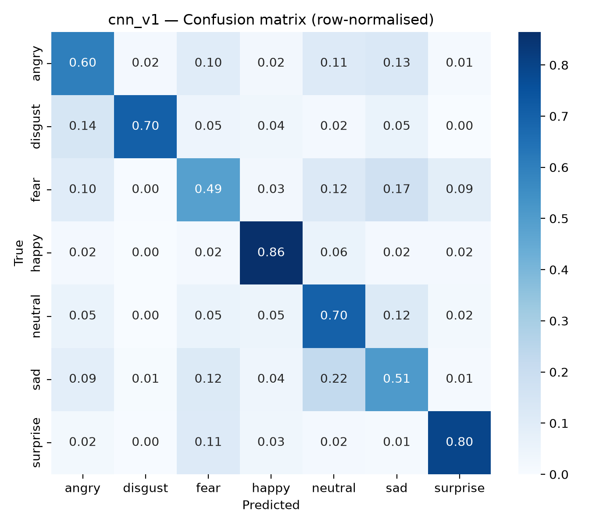

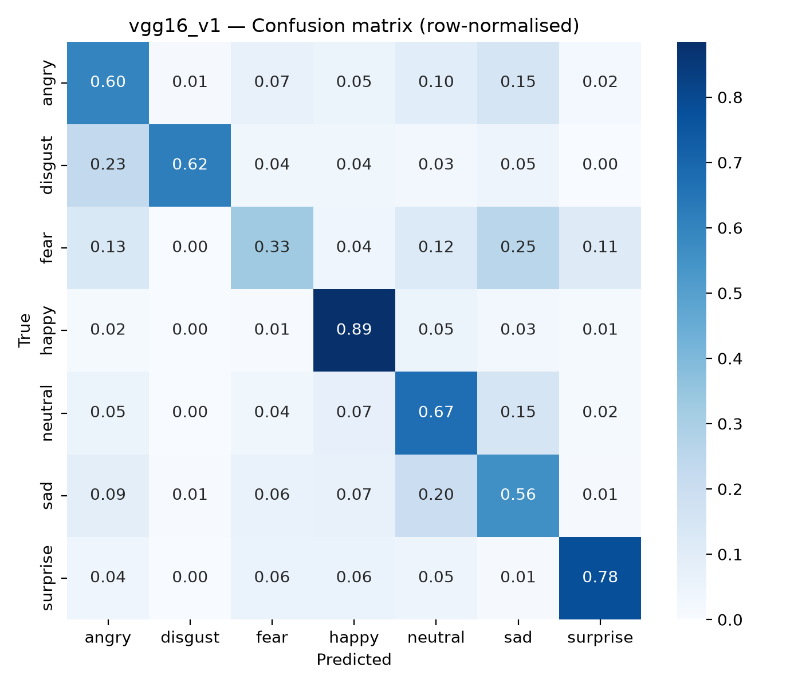

### 4.4 Computational cost

On the development CPU the custom CNN runs at about 25 frames per second for the model alone, VGG16 at about 4.6. Live video also needs face detection, cropping and drawing, so end-to-end frame rates will be lower than these model-only figures. The 25 FPS figure is an upper bound for this pipeline on this laptop, not a measurement of the live application.

### 4.5 Robustness under simulated driving conditions

*TODO(robustness): fill from results/robustness.csv when the full run finishes. Report a table of accuracy and macro-F1 per condition for both models, the drop relative to `clean`, and which model degrades less under each condition. Figures: `robustness.png` (line chart) and `conditions_grid.png` (one example per condition).*

Partial results (three of six conditions, full test set) are logged and will be replaced by the final table: clean 0.676 / 0.655 (CNN / VGG16), low_light 0.286 / 0.218, glare 0.515 / 0.478.

### 4.6 What the networks look at (Grad-CAM)

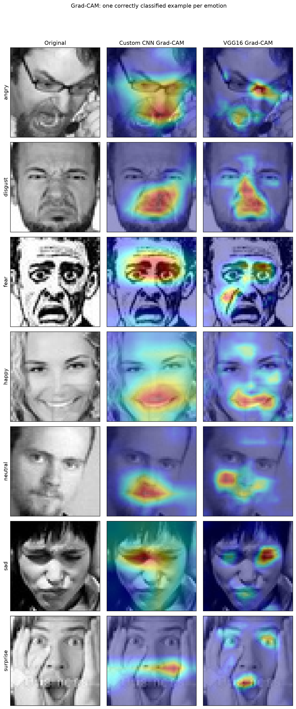

**Correct predictions (Figure 9).** Both networks concentrate on facial features: the mouth for *happy*, the brows and eyes for *sad* and *fear*, the nose and mouth for *disgust*, and the eyes and mouth for *angry*. In none of the seven examples is the main evidence in the background. Two weaknesses are visible: the CNN's map for *surprise* is a vague horizontal band across the whole width, and both models look at the lower face rather than the eyes for *neutral*. The CNN's maps are blobbier because its last convolutional layer is only 6 × 6 at this input size; VGG16's 14 × 14 maps are sharper.

**Errors (Figures 10 and 11).** The custom CNN's hot spots in its errors mostly stay on the face (nose bridge, mouth, brows, cheeks), with two of six uncertain (hair and a region at the image edge). For VGG16, four of the six sampled errors have their main hot spot away from the expressive regions: the hair-line and a hand, a frame edge, a bottom corner, and a baseball cap. In one *surprise* error, VGG16 looks only at the mouth and ignores the wide-open eyes. This is consistent with VGG16's weaker *fear* recall, but it is a qualitative impression from a handful of hand-inspected images, and Grad-CAM shows where the gradient signal lies and not what the model "relies on".

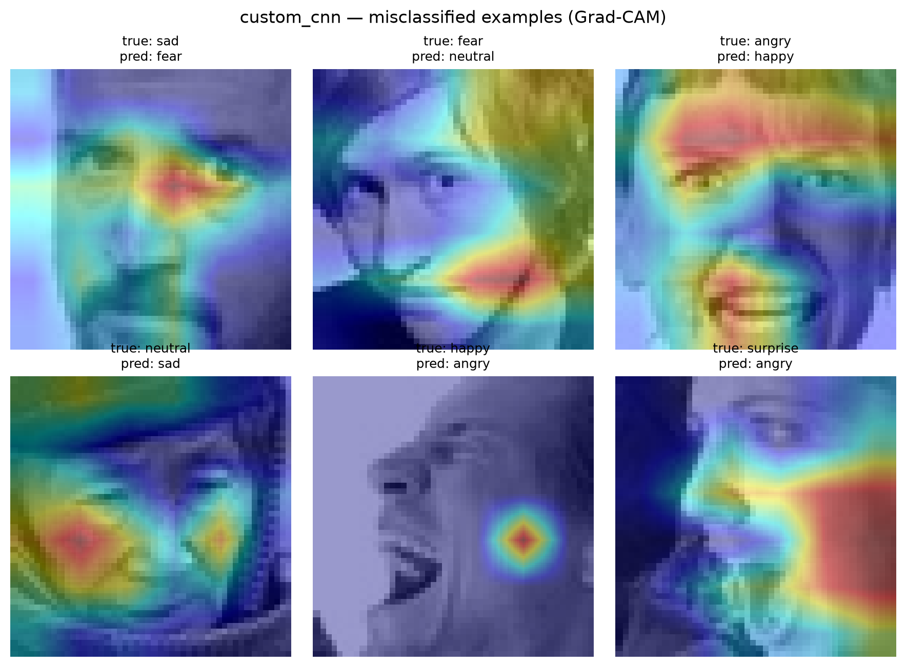

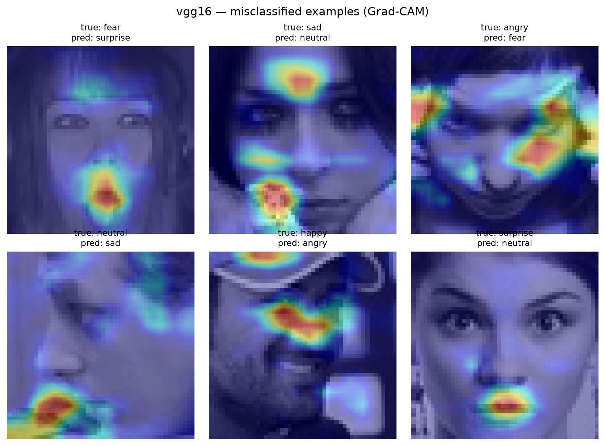

---

## 5. Discussion

### 5.1 Accuracy versus cost (RQ1)

The main finding is negative for transfer learning: a 4.8 M-parameter network trained from scratch matched or slightly exceeded fine-tuned VGG16 on every metric while being 5.4 times faster and half the size. We can offer hypotheses but have not tested them. (a) FER2013 images are 48-pixel grayscale faces, far from the colour, high-resolution ImageNet images on which VGG16's features were learned; the frozen-base stage reaching only about 50% is consistent with that. (b) Only the last convolutional block was fine-tuned, at a small learning rate; unfreezing more, or using a different schedule, might help. (c) VGG16 has three times the parameters of the CNN on about 24,000 training images, and its validation loss diverges from its training loss earlier. We did no hyper-parameter search for either model, and each was trained once, so the comparison is between two reasonable configurations and not between two tuned models. Both are also below the low-70s accuracies reported for heavily tuned FER2013 systems [9], which is expected given the absence of tuning, test-time augmentation and ensembling.

### 5.2 Which model suits a vehicle

On the evidence here, the custom CNN is the better fit for an in-vehicle system: equal or better accuracy, a much lower computational cost, and a smaller file. VGG16's cost is a real disadvantage on modest hardware (4.6 FPS on our CPU), and it is the worse model on *fear*, an alert emotion. This conclusion is specific to FER2013-like data and to CPU inference; a GPU or accelerator would narrow the speed gap, though not the model-size gap.

### 5.3 Failure cases

The dominant errors are between visually similar, low-intensity negative expressions (*sad*↔*neutral*, *fear*→*sad*, *angry*→*sad*), which is also where human annotators disagree on FER2013. Some of the "errors" are probably label noise and not model failure. *TODO(robustness): add the failure analysis under low light, glare, blur, occlusion and rotation once those results are final.*

### 5.4 Pitfalls that produced plausible but wrong numbers

We report these because each one silently changed the results and each is easy to make.

1. **Augmentation applied after rescaling.** Keras' `RandomBrightness` and `RandomContrast` assume pixel values in [0, 255] by default. Applied after the images had been scaled to [0, 1], they added a brightness shift sized for the wrong range and wiped out the image (pixel values of 13–51 in a [0, 1] batch, several images entirely black). The first training run converged to 24% accuracy, roughly the share of the largest class, and was discarded. Augmenting the raw pixels first fixed it; the same ordering would have corrupted VGG16's mean-subtracted inputs.
2. **Aggressive class weights.** Balanced weights (disgust ≈ 9.4) destabilised training even after fix 1 (Section 3.6).
3. **Resizing method mismatch.** In the robustness code, enlarging 48-pixel images to 224 with OpenCV's area interpolation (nearest-neighbour-like when enlarging) instead of the bilinear resize used in training dropped VGG16 from 0.66 to 0.18 accuracy on *clean* faces. The bug was caught because the clean-condition accuracy did not match the separately measured test accuracy; the clean baseline is therefore a useful correctness check for any robustness harness.
4. **Stacked training histories.** A re-used run name made the logger append a third 40-epoch run to one history file; only the last block matched the saved model. Older blocks must not be quoted.

None of these was found by inspecting accuracy alone. Sanity checks that did find them were: inspecting an actual training batch, overfitting a single fixed batch (the custom CNN reaches 100% accuracy on one batch of 64 images both with and without dropout and L2, so its architecture and the labels are sound), and comparing a "clean" baseline against an independent measurement.

### 5.5 Limitations

- **Domain.** FER2013 consists of web images of mostly frontal or near-frontal faces, many of them posed, at 48 × 48 grayscale. An in-vehicle camera differs in resolution, viewpoint, spectrum (often near-infrared) and expression naturalness. We did not obtain an in-vehicle dataset such as KMU-FED [17], so **this study does not establish performance on real drivers.**
- **Simulated degradations.** The robustness conditions are simple synthetic transformations of clean images.
- **Single runs.** Each model was trained once; seed-to-seed variance is unknown, and we did not use confidence intervals or significance tests beyond the informal estimate in Section 4.2.
- **No tuning.** Neither model was tuned; the ranking might change with tuning.
- **Labels.** FER2013 labels are noisy, which caps attainable accuracy.
- **Grad-CAM** is qualitative, computed on a subset, with a handful of examples inspected by eye.
- **Real-time system.** Checked on simulated frames only, where individual predictions differ from the direct model output about one time in four because of framing (Section 3.9); no live evaluation with drivers or a real camera.
- **Latency** is for one laptop CPU and model inference only.

---

## 6. Ethics and privacy

*Consent.* Any live testing with volunteers requires their informed consent, and this study collected no new data about people. *Data minimisation.* The application processes frames on the local device, keeps no images, and writes only a timestamp, the predicted emotion, its confidence and the frame rate to a local file. *Validity.* Inferring a person's inner state from their face is contested: expressions vary across individuals and cultures and are not reliable indicators of emotion, so any deployed system should treat output as a weak, probabilistic cue, never as a fact about the driver, and should not be used to penalise drivers. *Bias.* FER2013 was collected from the web without controlled demographics; we did not measure performance across groups, so we cannot rule out uneven accuracy across age, gender or skin tone, and we make no fairness claim. *Misuse and regulation.* Emotion recognition can be repurposed for surveillance (for example by insurers or employers), and the regulatory treatment of emotion recognition is evolving; any real deployment would need legal review. *Alert design.* False alarms from a calming prompt are an annoyance; missed alerts (our *fear* recall is 0.49 for the better model) mean it cannot be relied on for safety.

---

## 7. Conclusion

On FER2013, a compact custom CNN built from VGG-style blocks (4.8 M parameters, trained from scratch) reached 67.5% test accuracy and 0.66 macro-F1, matching or slightly exceeding a fine-tuned VGG16 (65.8%, 0.64) while running 5.4 times faster and occupying half the space. Both models find *happy* and *surprise* easy and *fear* and *sad* hard, and VGG16 is notably worse at *fear*. Grad-CAM shows both attending to facial features when correct; VGG16's errors more often rest on off-face regions. *TODO(robustness): add the headline robustness finding.* The results support a small from-scratch model as the more practical choice for a CPU-bound in-vehicle system, subject to the important limitation that everything here was measured on web images and simulated degradations, not on drivers.

**Future work.** Evaluate on in-vehicle data (for example KMU-FED [17]); train with the robustness corruptions as augmentation; repeat runs over several seeds with paired significance tests; tune both models; try near-infrared imagery; and run and report a live end-to-end evaluation with consenting volunteers.

---

## References

*Written from memory, so verify each entry (authors, year, venue, pages or DOI) before submission.*

[1] World Health Organization, *Global Status Report on Road Safety 2023*. Geneva: WHO, 2023.

[2] M. Jeon, "Don't cry while you're driving: Sad driving is as bad as angry driving," *International Journal of Human–Computer Interaction*, vol. 32, no. 10, pp. 777–790, 2016.

[3] J. Mesken, M. P. Hagenzieker, T. Rothengatter and D. de Waard, "Frequency, determinants, and consequences of different drivers' emotions: An on-the-road study using self-reports, (observed) behaviour, and physiology," *Transportation Research Part F*, vol. 10, no. 6, pp. 458–475, 2007.

[4] I. J. Goodfellow *et al.*, "Challenges in representation learning: A report on three machine learning contests," in *Neural Information Processing (ICONIP 2013)*, LNCS 8228, pp. 117–124, 2013.

[5] E. Barsoum, C. Zhang, C. Canton Ferrer and Z. Zhang, "Training deep networks for facial expression recognition with crowd-sourced label distribution," in *Proc. ACM ICMI*, 2016.

[6] P. Ekman and W. V. Friesen, "Constants across cultures in the face and emotion," *Journal of Personality and Social Psychology*, vol. 17, no. 2, pp. 124–129, 1971.

[7] S. Li and W. Deng, "Deep facial expression recognition: A survey," *IEEE Transactions on Affective Computing*, vol. 13, no. 3, pp. 1195–1215, 2022.

[8] A. Mollahosseini, B. Hasani and M. H. Mahoor, "AffectNet: A database for facial expression, valence, and arousal computing in the wild," *IEEE Transactions on Affective Computing*, vol. 10, no. 1, pp. 18–31, 2019.

[9] Y. Khaireddin and Z. Chen, "Facial emotion recognition: State of the art performance on FER2013," arXiv:2105.03588, 2021.

[10] Y. LeCun, Y. Bengio and G. Hinton, "Deep learning," *Nature*, vol. 521, pp. 436–444, 2015.

[11] A. Krizhevsky, I. Sutskever and G. E. Hinton, "ImageNet classification with deep convolutional neural networks," in *Advances in Neural Information Processing Systems 25*, 2012.

[12] K. Simonyan and A. Zisserman, "Very deep convolutional networks for large-scale image recognition," in *Proc. ICLR*, 2015 (arXiv:1409.1556).

[13] O. Russakovsky *et al.*, "ImageNet large scale visual recognition challenge," *International Journal of Computer Vision*, vol. 115, no. 3, pp. 211–252, 2015.

[14] S. Ioffe and C. Szegedy, "Batch normalization: Accelerating deep network training by reducing internal covariate shift," in *Proc. ICML*, pp. 448–456, 2015.

[15] N. Srivastava, G. Hinton, A. Krizhevsky, I. Sutskever and R. Salakhutdinov, "Dropout: A simple way to prevent neural networks from overfitting," *Journal of Machine Learning Research*, vol. 15, pp. 1929–1958, 2014.

[16] D. P. Kingma and J. Ba, "Adam: A method for stochastic optimization," in *Proc. ICLR*, 2015.

[17] M. Jeong and B. C. Ko, "Driver's facial expression recognition in real-time for safe driving," *Sensors*, vol. 18, no. 12, art. 4270, 2018.

[18] R. R. Selvaraju *et al.*, "Grad-CAM: Visual explanations from deep networks via gradient-based localization," in *Proc. IEEE ICCV*, pp. 618–626, 2017.

[19] V. Bazarevsky, Y. Kartynnik, A. Vakunov, K. Raveendran and M. Grundmann, "BlazeFace: Sub-millisecond neural face detection on mobile GPUs," arXiv:1907.05047, 2019.

*Software:* TensorFlow/Keras, OpenCV, scikit-learn, NumPy, pandas, matplotlib, MediaPipe. All code, configuration, logs and figures are in the project repository (`docs/experiment_log.md` records every run and decision).
